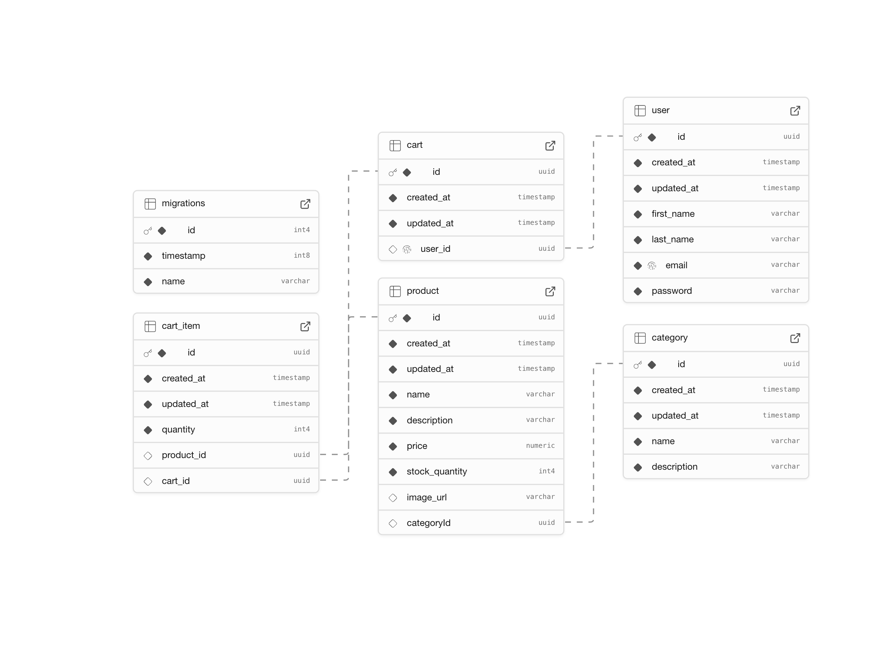

# E-Commerce GraphQL API

This is a GraphQL API for an e-commerce platform built with Node.js, TypeORM, and PostgreSQL.

## Schema




## Features

- User authentication (register/login)
- Products management
- Categories management
- Shopping cart functionality

## Tech Stack

- Node.js & Express
- GraphQL with Apollo Server
- TypeScript
- PostgreSQL database
- TypeORM for ORM
- Type-GraphQL for GraphQL schema definitions

## Prerequisites

- Node.js (v16+)
- PostgreSQL server running
- npm or yarn

## Setup

1. Clone the repository
2. Install dependencies:
   ```bash
   npm install
   ```
3. Create a Supabase account and project at https://supabase.com
4. Configure your Supabase connection in `.env` file:
   ```
   # Supabase Database Configuration
   DB_HOST=db.your-supabase-project-id.supabase.co
   DB_PORT=5432
   DB_USERNAME=postgres
   DB_PASSWORD=your-supabase-db-password
   DB_DATABASE=postgres
   SUPABASE_URL=https://your-supabase-project-id.supabase.co
   SUPABASE_KEY=your-supabase-anon-key
   
   # Server Configuration
   PORT=4000
   NODE_ENV=development
   ```

## Running the Application

Development mode:
```bash
npm run dev
```

Production build:
```bash
npm run build
npm start
```

## GraphQL API Endpoints

The GraphQL API is available at `/graphql`. Here are the main operations:

### Authentication

```graphql
# Register a new user
mutation Register($input: RegisterUserInput!) {
  register(input: $input) {
    id
    firstName
    lastName
    email
  }
}

# Login
mutation Login($input: LoginInput!) {
  login(input: $input) {
    id
    firstName
    lastName
    email
  }
}
```

### Categories

```graphql
# Get all categories
query GetCategories {
  categories {
    id
    name
    description
    products {
      id
      name
    }
  }
}

# Get a single category
query GetCategory($id: String!) {
  category(id: $id) {
    id
    name
    description
    products {
      id
      name
      price
      description
    }
  }
}

# Create a category
mutation CreateCategory($input: CreateCategoryInput!) {
  createCategory(input: $input) {
    id
    name
    description
  }
}
```

### Products

```graphql
# Get all products
query GetProducts {
  products {
    id
    name
    description
    price
    stockQuantity
    imageUrl
    category {
      id
      name
    }
  }
}

# Get a single product
query GetProduct($id: String!) {
  product(id: $id) {
    id
    name
    description
    price
    stockQuantity
    imageUrl
    category {
      id
      name
      description
    }
  }
}

# Create a product
mutation CreateProduct($input: CreateProductInput!) {
  createProduct(input: $input) {
    id
    name
    description
    price
    stockQuantity
    imageUrl
    category {
      id
      name
    }
  }
}
```

### Cart Operations

```graphql
# Get user's cart
query GetCart($userId: String!) {
  cart(userId: $userId) {
    id
    items {
      id
      quantity
      product {
        id
        name
        price
        imageUrl
      }
    }
    user {
      id
      firstName
      lastName
    }
  }
}

# Add item to cart
mutation AddToCart($userId: String!, $input: AddToCartInput!) {
  addToCart(userId: $userId, input: $input) {
    id
    items {
      id
      quantity
      product {
        id
        name
        price
      }
    }
  }
}

# Remove item from cart
mutation RemoveFromCart($userId: String!, $cartItemId: String!) {
  removeFromCart(userId: $userId, cartItemId: $cartItemId) {
    id
    items {
      id
      quantity
      product {
        id
        name
        price
      }
    }
  }
}
```

## Database Schema

The application uses the following entity relationships:

- **User**: Basic user information and authentication
- **Category**: Product categories
- **Product**: Product details with category relationship
- **Cart**: User's shopping cart
- **CartItem**: Items in a user's cart with quantity

## License

MIT
